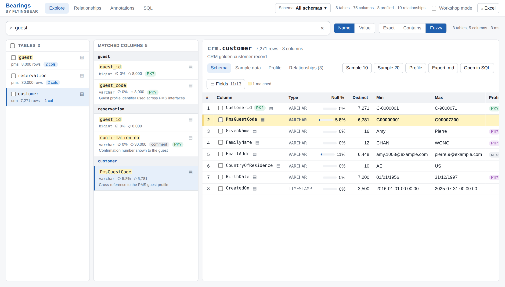
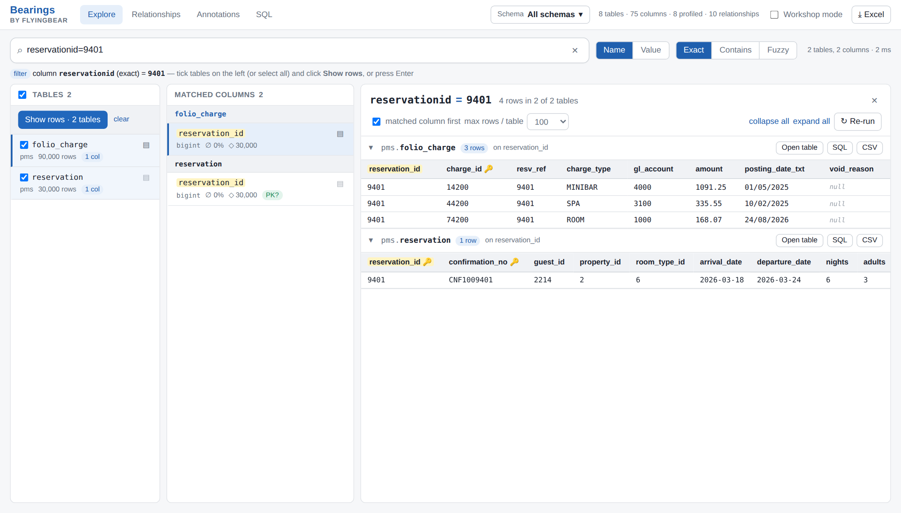
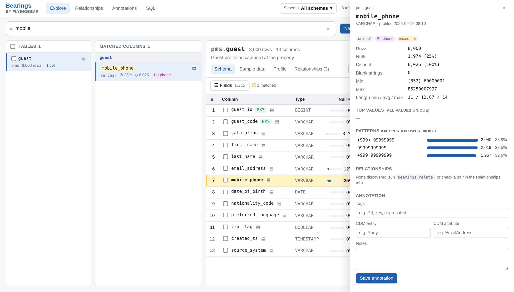
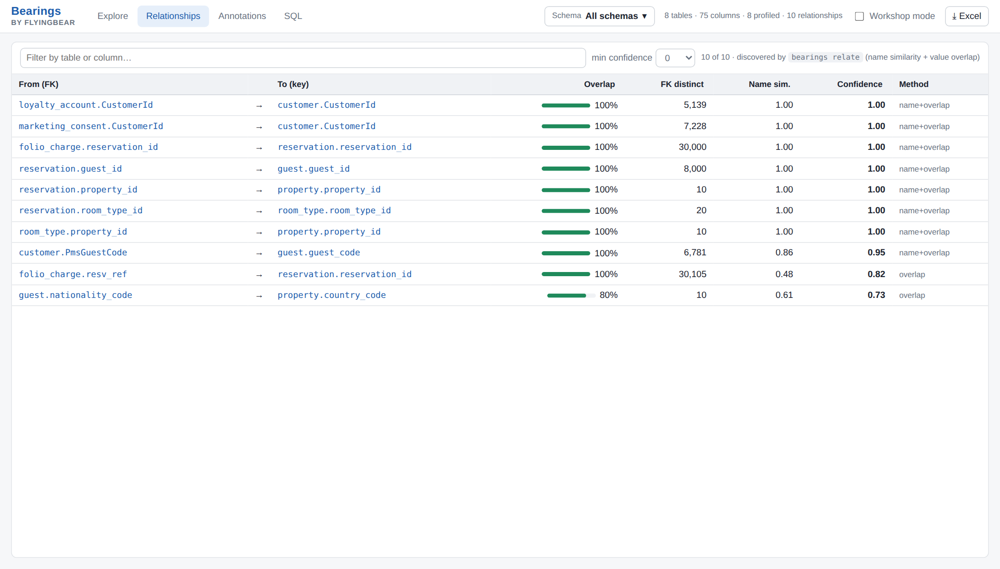

<h1 align="center">🐻 Bearings</h1>
<p align="center"><b>Get your bearings in unfamiliar source data.</b><br>
A local data-modelling workbench: load CSV, Parquet, JSON or Excel exports into DuckDB (or attach Azure Databricks), then search, profile, sample and relate them from a fast web UI.</p>
<p align="center">
  <a href="LICENSE"></a>
  
  
  
</p>



When you're dropped into a new data-modelling engagement, the first weeks go into "where is the guest ID?", "which of these 400 columns are always empty?" and "how do these two systems join?". Bearings answers those questions in seconds, **entirely on your machine**, so client data never leaves your laptop.

- **Add data without typing:** drop files or a whole folder onto the app (CSV, TSV, Parquet, JSON, Excel), or pick a folder on your machine. Bearings previews the tables it found, then loads, profiles and relates them in the background.
- **Search everything:** fuzzy, contains or exact search over table and column names, comments, tags and CDM mappings. Search *values* too: "which columns contain `G00000042`?"
- **Two-layer results:** tables on the left, matched columns next to them, and the full schema with the matches highlighted.
- **Profile at a glance:** null % and distinct counts, top values, value patterns, histograms, and flags for candidate keys, PII, mixed formats and constant columns.
- **Look up a key across tables:** type `reservationid=9401`, tick the tables, and see every matching row side by side.
- **Relationship discovery:** likely FK → key links from name similarity plus value overlap, including across source systems, with measured **cardinality** (1:1 / 1:N / N:M), optionality and orphan rows, and a **Mermaid ER diagram** export.
- **Data quality:** outliers and stray negative amounts, **near-duplicate records** (the same customer captured twice), conditional completeness ("company_name is only filled for corporate guests"), and **suggested DQ rules** exported for **Databricks DQX**, **Great Expectations** and **Microsoft Purview**.
- **Code lists and cross-system comparison:** every low-cardinality column with all its values, compared value by value with the same code in another system (mapping CSV), and a side-by-side **attribute comparison** of linked records ("is the e-mail the same in the CRM and the PMS?").
- **Modelling insights:** the **grain** of each table ("one row per CustomerId + Channel"), **time coverage** of its date columns (history, gaps, future rows, sentinel dates), and **dependencies between columns** turned into candidate entities, hierarchies and code ↔ description pairs – plus **disguised nulls** (`N/A`, `-`, `1900-01-01`) and **type hints** for text columns.
- **Annotate and export:** tag columns (PII, key…), map them to CDM entities and attributes, and export an Excel mapping workbook, JSON or Markdown specs.
- **Schema scope:** load each source system into its own schema and focus the whole app on one or several of them.
- **Workshop mode:** bigger text, and PII masked in samples, for screen-sharing with a room full of stakeholders.
- **Keyboard-first:** <kbd>⌘/Ctrl K</kbd> jumps to any table or column, <kbd>↑</kbd><kbd>↓</kbd> walk the result list, <kbd>1</kbd>–<kbd>4</kbd> switch views, and every grid has a quick filter, remembered sort, *hide empty columns* and double-click-to-copy.

| Look up a key across tables | Column profile | Discovered relationships |
|---|---|---|
|  |  |  |

```
exports (csv/parquet/json/xlsx) ──bearings load / drop in the app──▶ data/bearings.duckdb ──bearings profile / relate──▶ _meta.* ──bearings serve──▶ http://127.0.0.1:8765
                                                        annotations → data/bearings.annotations.sqlite (kept when you rebuild the DB)
```

## Install

Dependencies are managed with [uv](https://docs.astral.sh/uv/) (`pyproject.toml` + `uv.lock`, Python pinned in `.python-version`).

```bash
# macOS: brew install uv    ·    Linux/macOS: curl -LsSf https://astral.sh/uv/install.sh | sh    ·    Windows: winget install astral-sh.uv
git clone https://github.com/flyingbearhk/bearings.git
cd bearings
uv sync                    # creates .venv and installs the locked deps + the `bearings` command (alias: `dm`)
```

Run commands with `uv run bearings …` (as below), or `source .venv/bin/activate` once and drop the `uv run` prefix. `dm` is a short alias for `bearings`.

The web UI comes prebuilt in `bearings/static/`, so you only need Node if you want to change the UI.

## Quick start with sample data (5 minutes)

To try the tool before real exports arrive, `bearings demo` generates a **fictional hotel dataset** from two "source systems". It then loads, profiles and relates the data into a separate `data/demo.duckdb`, so your real database isn't touched.

```bash
uv sync                                   # first time only
uv run bearings demo                            # ~7 s: generate → load → comments → profile → relate → insights
uv run bearings serve --db data/demo.duckdb     # open http://127.0.0.1:8765
```

| Schema | Table | Rows | Format | What's in it |
|---|---|---|---|---|
| `pms` | property | 10 | Parquet | Hotel master: code, name, country, currency, rooms (`brand_segment` is always null) |
| `pms` | room_type | 40 | Parquet | 4 room types per property |
| `pms` | guest | 8,000 | Parquet | Guest profiles with PII: names, email (nulls and blanks), phone in 3 formats, DOB; corporate guests (`guest_type`) with `company_name` / `company_tax_id` – a subtype |
| `pms` | reservation | 30,000 | Parquet **folder of 3 part-files** | Stays: dates, status, channel, segment, rate plan, revenue (room type implies the hotel) |
| `pms` | folio_charge | 90,000 | CSV | Charges; `resv_ref` is a legacy FK with orphans; `posting_date_txt` has mixed date formats; `amount` has refunds (negative) and a few amounts keyed without the decimal point |
| `crm` | customer | ~7,300 | CSV | CamelCase naming, text IDs, `PmsGuestCode` cross-reference, **duplicate customers** (the same guest captured again: upper-case or misspelt surname, missing e-mail, birth date in another format) |
| `crm` | loyalty_account | ~5,100 | CSV | Tier and points per customer |
| `crm` | marketing_consent | ~17,400 | CSV | Opt-in per channel (`CaptureSource` is constant; no single-column key) |
| `dwh` | stay_flat | 30,000 | CSV | A **flattened reporting extract**: one row per stay with hotel, region, brand and room-type attributes repeated; ~1 % misspelt hotel names, placeholder company names (`N/A`, `-`, `UNKNOWN`), `cancel_date` = `1900-01-01` when not cancelled |

Options: `--scale 5` makes about 5× more rows (useful for testing performance). `--files-only` writes only the export files, so you can practise the real `bearings load` / `bearings profile` / `bearings relate` steps yourself:

```bash
uv run bearings demo --files-only                       # → demo/exports/pms, demo/exports/crm, demo/exports/dwh, demo/comments.csv
uv run bearings load demo/exports/pms --schema pms --db data/play.duckdb
uv run bearings load demo/exports/crm --schema crm --db data/play.duckdb
uv run bearings load demo/exports/dwh --schema dwh --db data/play.duckdb
uv run bearings comments demo/comments.csv --db data/play.duckdb
uv run bearings profile --db data/play.duckdb
uv run bearings relate --deep --db data/play.duckdb
uv run bearings insights --show --db data/play.duckdb
uv run bearings serve --db data/play.duckdb
```

### Things to try in the demo

1. **Fuzzy name search.** Try `guest`. The table matches, and so do `reservation.guest_id`, `crm.customer.PmsGuestCode` (a different naming style) and `reservation.confirmation_no`, which matches through its comment. Then try `email`, `revenue`, `*_code` and `confirmation number`, which is found through the column comment.
2. **Two-layer results.** Click `PmsGuestCode` in the column list to open the `customer` schema with that row highlighted. Click **Sample 30**, then use **Columns → Matched first** to reorder the sample.
3. **Profiling.** Use the ▤ button on `pms.guest`. `mobile_phone` shows *mixed fmt* (three formats), `email_address` shows *PII email* and *blanks*, and `vip_flag` has an uneven true/false split. Also look at `folio_charge.posting_date_txt` (*type hint*: a DATE stored as text, in two formats) and `property.brand_segment` (*all null*). In `dwh.stay_flat`, `company_name` is 20 % null but **70 % effectively empty** (*placeholders*: `N/A`, `-`, `UNKNOWN`), and `cancel_date` is 91 % `1900-01-01`.
4. **Value search.** Switch to *Value* and search `G00000042` (exact). It turns up in both `pms.guest.guest_code` and `crm.customer.PmsGuestCode`, which is how you'd find cross-system keys. Clicking any top value in a profile drawer searches for that value everywhere.
5. **Relationships tab.** Includes the cross-system link `crm.customer.PmsGuestCode → pms.guest.guest_code`, and `folio_charge.resv_ref → reservation.reservation_id`, found by value overlap even though the names don't match. It also shows a coincidental match, `guest.nationality_code → property.country_code` (1,600 orphan rows), which is a good reminder to review what the discovery suggests. The **Cardinality** column says how each link behaves: `loyalty_account → customer` is an optional **1:1** extension (30 % of customers have none), `PmsGuestCode → guest` allows up to **2** customers per guest (the CRM duplicates). Filter to `reservation` and click **◇ ER diagram**: untick the entities you don't want and the diagram redraws; download it as `.mmd` (Mermaid) or `.svg`. From a table, **Relationships → ◇ ER diagram** draws that table with its direct links (or 2 hops). Use **Check a join manually** to see orphan `resv_ref` values.
6. **Key check.** In `crm.customer`, tick `PmsGuestCode` and click **Check key**. It's not unique, because the CRM has duplicate customers, and the check shows example duplicates. In `pms.reservation`, tick `guest_id` + `arrival_date`.
7. **Annotate.** Open `crm.customer.EmailAddr`, tag it `PII, contact`, and set CDM `Party` / `EmailAddress`. Do the same for `pms.guest.email_address`. Search `Party` to find both, then **⤓ Excel** exports the mapping workbook.
8. **Workshop mode.** Tick it in the header. The text gets bigger and PII columns are masked in samples.
9. **Insights.** Open `dwh.stay_flat` and its **Insights** tab (or <kbd>5</kbd>). The header already says *one row per stay_id* and *History arrival_date Jan 2025 – Oct 2026*. The tab finds the **Property** entity (`property_code = country_code = property_name = local_currency` → `region_name`, `brand_name`), the hierarchies **Room type → Property → Region / Brand**, a **redundant FK** (the room type already implies the hotel) and the misspelt hotel names (*property_name depends on property_code for 99 % of rows* → **show exception rows**). **Map to CDM entity** writes the mapping to all those columns. Also try `crm.marketing_consent` (grain **CustomerId + Channel**) and `pms.folio_charge` (`charge_type = gl_account`: a code list mapped 1:1 to GL accounts).
10. **Subtypes.** In `pms.guest` → **Insights**, *Optional attributes and subtypes* says `company_name, company_tax_id` are filled together only when `guest_type = CORPORATE` – a possible *Corporate guest* subtype (**by guest_type** shows the breakdown). In `dwh.stay_flat`, `cancel_date` is only filled when `status_code = CXL`.
11. **Quality.** `crm.customer` → **Quality** → **Find duplicates**: 71 pairs such as *Rossi* / *Rossie* with the same birth date written two ways. `pms.folio_charge` → **Quality** shows the refunds and the amounts keyed without a decimal point, and the **suggested data-quality rules** (untick what doesn't apply, then **⤓ DQX .yml**, **⤓ GX .json**, **⤓ Purview .csv** or all as a .zip; for every table: **Annotations → ⤓ DQ rules** or `bearings dq-rules`).
12. **Code lists.** The **Code lists** tab lists every low-cardinality column. Pick `crm.customer.CountryOfResidence`: it's compared with `pms.guest.nationality_code` automatically (100 % shared values); `pms.reservation.status_code` vs `dwh.stay_flat.status_code` gives a value mapping to download.
13. **Compare attributes.** Relationships → filter `PmsGuestCode` → **⇄ compare**: first names and countries agree, birth dates agree once the format is normalised, surnames differ in 23 rows (click the pair for them), and each system has e-mails the other lacks.
14. **SQL tab.** Try `SUMMARIZE pms.reservation`, or:
   ```sql
   SELECT c.CustomerId, g.guest_code, g.email_address, c.EmailAddr
   FROM crm.customer c JOIN pms.guest g ON g.guest_code = c.PmsGuestCode
   WHERE coalesce(g.email_address,'') <> coalesce(c.EmailAddr,'') LIMIT 50
   ```

Start over at any time with `uv run bearings demo`, which rebuilds `data/demo.duckdb`. Demo annotations are kept in `data/demo.annotations.sqlite`, separate from your real ones.

## Workflow

```bash
# 1. Load. A file becomes one table; a folder of Spark part-files becomes one table named after the folder;
#    every non-empty sheet of an Excel workbook becomes a table. (Or drop the files onto the app: ＋ Add data.)
uv run bearings load ./exports/opera --schema pms          # --append to add files, --all-varchar to keep raw text (leading zeros)
uv run bearings load ./exports/crm   --schema crm
uv run bearings load ./reference/hotel_master.xlsx -s ref  # --sheet Properties (repeatable), --header-row 3, --dry-run to preview

# 2. Optional: descriptions from Databricks (they become searchable)
uv run bearings comments ./exports/columns.csv             # needs table_name, column_name, comment [, table_schema]

# 3. Profile (standard profile → _meta.column_profile / table_profile)
uv run bearings profile                                    # all tables
uv run bearings profile -t pms.reservation --sample-rows 2000000   # big table: profile a random sample
uv run bearings profile --only-new                         # only tables that aren't profiled yet

# 4. Relationship discovery (name similarity + value overlap; cardinality measured on the rows)
uv run bearings relate                                     # --deep also tests *_id/_code/_ref columns whose names don't match

# 5. Modelling insights: grain, time coverage, dependencies → candidate entities and hierarchies
uv run bearings insights                                   # --show prints the entities; -t / -s to narrow; --missing skips up-to-date tables; --only grain,time,deps,codes,optional

# 6. Data-quality rules for DQX / Great Expectations / Purview (from the profile, insights and relationships)
uv run bearings dq-rules -o dq_rules.zip                   # or .yml (DQX), .json (GX), .csv (Purview); -s / -t, --errors-only

# 7. Run the app
uv run bearings serve                                      # http://127.0.0.1:8765

# Other commands
uv run bearings info                                       # tables, row counts, profile status (-s pms to filter)
uv run bearings report -o catalog.xlsx                     # Tables / Columns (+profile, tags, CDM) / Relationships / Grain & history / Candidate entities / Dependencies (-s pms to filter)
uv run bearings duplicates crm.customer                    # near-duplicate records (-c email=EmailAddr to choose columns)
uv run bearings drop pms.folio_charge                      # remove one table (or a whole schema: bearings drop pms)
uv run bearings reset                                      # start fresh – see "Resetting the database" below
```

The server holds the database lock only for the length of each request, so you can run `bearings load`, `bearings profile` or `bearings relate` while `bearings serve` is running (in another terminal). Refresh the browser afterwards. A GUI client such as DBeaver that keeps the file open will block writes.

Use `--db path/to/other.duckdb` or `export BEARINGS_DB=...` to keep a separate database per engagement or domain.

### Supported files

| Format | Extensions | How it maps to tables |
|---|---|---|
| CSV / TSV | `.csv` `.tsv` `.txt` (+ `.gz`) | One table per file. Types are inferred from all rows; `--all-varchar` keeps everything as text. |
| Parquet | `.parquet` `.pq` | One table per file. |
| JSON | `.json` `.jsonl` `.ndjson` (+ `.gz`) | Arrays, objects or newline-delimited JSON; one table per file. |
| Excel | `.xlsx` `.xlsm` | **One table per non-empty sheet**: `<file>_<sheet>`, or just `<file>` when there is one sheet. Types come from the cell types Excel stored, so a text column keeps leading zeros (`00123`), whole numbers become BIGINT and dates DATE/TIMESTAMP; a column mixing types becomes text. Formulas load as their last calculated value. The header is the first non-empty row (`--header-row N` to override). Legacy `.xls`: save as `.xlsx` first. |

A sub-folder of **part-files** (Spark / Databricks `part-00000-….parquet`, hive partitions `year=2026/…`, or numbered chunks `guest_001.csv`) becomes one table named after the sub-folder. Any other sub-folder is loaded file by file. Readers live in `bearings/loaders/`; adding a format is one small class (see `FileReader`).

### Adding data from the app

Click **＋ Add data** (or press <kbd>a</kbd>, or simply drop files anywhere on the page):

- **Drop files or a folder**: they're copied into `data/uploads/` and previewed. A dropped folder's name becomes the suggested schema.
- **Or a path on this computer**: type or paste it, or **Browse…** to click through folders. Nothing is copied. For your safety this only works in a browser on the machine running Bearings.
- The **preview** lists every table it found (tick the ones you want), flags tables that already exist, offers *Replace* or *Append*, Excel sheet / header-row options and *all as text*. It also recognises **description files** (CSV with `table_name, column_name, comment`) and imports them as searchable comments.
- **Load** runs in the background: load → descriptions → profile → relationships touching the new schema. The app refreshes when it's done, and one click opens the first table.

### Several source systems: schemas and the schema scope

Load each source system into its own schema. The schema name becomes the first part of every table name (`pms.reservation`, `crm.customer`):

```bash
uv run bearings load ./exports/opera   --schema pms
uv run bearings load ./exports/crm     --schema crm
uv run bearings load ./exports/finance --schema fin
uv run bearings profile                         # or per system: bearings profile -s crm
uv run bearings relate -s pms                   # links inside one system
uv run bearings relate -s pms -s crm            # also cross-system links between pms and crm
```

In the app, the **Schema** dropdown in the header sets the **scope**. Tick one or more schemas, or click **only** next to one. After that, everything covers only those schemas:

- name and value search, the table list and filter lookups (`reservationid=9401`)
- the Relationships tab, which shows only links with both ends in scope
- the Annotations tab and the **Excel / JSON exports** (the file name includes the schema)
- the SQL tab's table list. The SQL console itself can still query any table.

The scope button turns yellow when a scope is active, so you can see results are filtered. The app remembers your choice. To open the app already scoped:

```bash
uv run bearings serve -s crm              # or -s pms -s crm
```

The CLI has the same filter: `bearings info -s crm`, `bearings report -s crm -o crm_catalog.xlsx`, `bearings profile -s crm`, `bearings relate -s crm`.

For fully separate engagements or clients, use **separate database files** instead of schemas: `--db data/client-a.duckdb` or `export BEARINGS_DB=data/client-a.duckdb`. Each database gets its own annotations file.

### Removing a schema, or resetting the database

Stop `bearings serve` (Ctrl+C) first, or run the command in another terminal and refresh the browser afterwards. Every command asks for confirmation; add `-y` to skip it. `uv run bearings info` lists your schemas if you need the exact name.

**Remove one schema.** Which command depends on where the schema came from:

```bash
uv run bearings drop pms            # a local schema (loaded from CSV/Parquet): its tables, profiles and relationships
uv run bearings detach dev_raw_pms  # a schema attached from Databricks: cached metadata, profiles, key values and local copies
uv run bearings compact             # afterwards: shrink the database file
```

Both keep your annotations (tags, CDM mappings, notes) unless you add `--annotations`. `detach` never touches Databricks – it only forgets what Bearings cached locally; attach the schema again (`bearings connect` or `bearings attach`) and its annotations reappear. `bearings drop <alias>` on a remote schema does the same as `detach`.

| Goal | Command |
|---|---|
| Wipe everything and **keep** your annotations (tags, CDM mappings, notes) | `uv run bearings reset` |
| Wipe everything **including** annotations | `uv run bearings reset --annotations` |
| Reset one source system only (drop the schema's tables, profile and relationships; compact the file) | `uv run bearings reset -s crm` (add `--annotations` to also remove its annotations) |
| Remove one table | `uv run bearings drop pms.folio_charge` |
| Remove one local schema | `uv run bearings drop crm` (add `--annotations` to also remove its annotations) |
| Remove one Databricks schema (cached metadata, profiles, key values, local copies) | `uv run bearings detach dev_raw_pms` (Databricks itself is not touched) |
| Remove a local copy of a remote table, keep the table attached | `uv run bearings drop dev_raw_pms.reservation` – it goes back to live on Databricks; re-profile it with `uv run bearings profile -t dev_raw_pms.reservation` |
| Reset the demo | `uv run bearings reset --db data/demo.duckdb --annotations`, or just `uv run bearings demo` again, which rebuilds it |
| Shrink the file after drops | `uv run bearings compact` (DuckDB doesn't give space back on its own) |

Annotations are kept by default because they're manual work. They're stored in `data/<db-name>.annotations.sqlite` and match on schema/table/column names, so when you reload the same tables they reappear automatically.

To reload a system from scratch:

```bash
uv run bearings reset -s pms -y
uv run bearings load ./exports/opera --schema pms && uv run bearings profile -s pms && uv run bearings relate -s pms && uv run bearings insights -s pms
```

The manual way: stop the server and delete the files. `rm data/bearings.duckdb data/bearings.duckdb.wal` wipes the data; also delete `data/bearings.annotations.sqlite` to lose the annotations. `rm -rf demo/ data/demo.*` removes the demo.

### Remote mode: connect to Azure Databricks (preview)

Remote platforms plug in as **connectors** (`bearings/remote/connectors/`). Databricks is the one built in; a connection profile's `type` (default `databricks`) picks the connector, and `bearings remote types` lists what's available. Everything below (attach, sync, profile, pull, cache, live queries, the SQL console) goes through the connector interface, so a new platform only has to implement it – see [docs/design/connectors.md](docs/design/connectors.md).

Instead of exporting files, you can attach a Unity Catalog schema directly. Bearings syncs its **metadata** (tables, columns, types, comments) into the local database, so name search, annotations, CDM mappings and exports work on it straight away, even offline. The **rows stay in Databricks** until you copy a sample with `bearings pull`.

```bash
uv sync --extra databricks          # once: installs the Databricks SDK + SQL connector
uv run bearings connect             # guided: workspace URL → browser sign-in → warehouse → catalog → schemas → profile → local copies
uv run bearings serve
uv run bearings refresh             # later: re-sync metadata, re-profile what changed, re-find relationships
```

`bearings connect` asks five questions and does the rest: attach, profile on the warehouse, find relationships, and cache the tables locally. It can also be scripted:

```bash
uv run bearings connect --host adb-1234567890.12.azuredatabricks.net -c dev_catalog -s raw_pms -s gold_pms --prefix dev_ --profile --cache-max-rows 300000 -y
```

The individual steps are still available when you want finer control:

```bash
uv run bearings remote add dev --host https://adb-1234567890.12.azuredatabricks.net
uv run bearings remote login dev                        # browser sign-in (Entra ID); the token is cached by the Databricks SDK
uv run bearings remote warehouses dev                   # SQL warehouse ids
uv run bearings remote add dev --warehouse <id>
uv run bearings remote test dev --catalog lakehouse           # checks sign-in, Unity Catalog and the SQL warehouse step by step
uv run bearings attach dev lakehouse.bronze_opera --as opera  # metadata only; default alias is <schema>_dbx
uv run bearings sync                                         # re-sync every attached schema and show what changed (--dry-run, -s, --catalog)
uv run bearings profile -s opera                             # profile on the SQL warehouse; stats, flags and key values are cached locally
uv run bearings relate -s opera                              # relationships between remote tables (and local ones: -s crm -s opera)
uv run bearings cache -s opera --max-rows 300000             # local cache: tables up to N rows whole, an N-row sample of bigger ones
uv run bearings cache -s opera --changed                     # re-cache tables whose schema or data changed (refresh does this for you)
uv run bearings cache -s opera --mask-pii                    # hash personal data in the cache + stored profile (remembered; --no-mask-pii)
uv run bearings pii -s opera                                 # which columns are masked and why (--keep / --mask to adjust)
uv run bearings cache -s opera --drop                        # empty the cache: tables run live on Databricks again
uv run bearings pull opera.reservation --rows 500000         # one table, your own sample size or --where filter
uv run bearings detach opera                                 # forget the cached metadata and pulled copies (Databricks is never touched)
```

- **Mixed scope.** Attached schemas appear in the **Schema** dropdown under their connection and catalog (☁), next to your local schemas. Tick any mix of them.
- **Re-sync.** The ↻ button next to a remote schema (or **sync all** for a catalog) re-reads it from Unity Catalog and lists what changed: tables and columns added or dropped, type and comment changes. The sync uses the Unity Catalog API, so it doesn't need a running SQL warehouse.
- **Annotations are never lost.** If a column you annotated was renamed or dropped upstream, the sync lists the annotation as *orphaned* with a suggested new column; click it (or run `bearings remap opera.reservation.arrival_dt arrival_date`) to move the tags, CDM mapping and notes. `bearings orphans` lists them at any time.
- **Profiling remote tables.** `bearings profile -s <alias>` (or ⚡ in the Schema dropdown / on a table) runs on the SQL warehouse: exact row, null and blank counts, min/max and distinct counts over the whole table, and a random sample (200,000 rows by default, `--sample-rows`) for top values, patterns, histograms and PII hints. Remote tables are only profiled when you name them (`-s`, `-t`, or `--remote`), so nothing runs on the warehouse by surprise. After a sync, `--only-stale` re-profiles just the tables that changed.
- **Key fingerprints.** Profiling also stores the distinct values of key-like columns (ids, codes, unique columns; up to 500,000 per column) in the local database. That's what lets `bearings relate`, the manual overlap check and value search work on remote tables without their rows, including between a remote schema and a local one. Use `--no-fingerprints` if an engagement doesn't allow key values on the laptop.
- **Local first.** Tables are cached in the local database, so search, samples, profiles, key checks, lookups and SQL run at local speed. Up to 300,000 rows (`--cache-max-rows` / `bearings cache --max-rows N`, remembered per schema; default from `BEARINGS_CACHE_MAX_ROWS`) a table is copied whole; a bigger table gets a random sample of that many rows, and keeps its exact whole-table profile from Databricks. Each table shows where its rows are:

  | Indicator | Meaning | Queries run on |
  |---|---|---|
  | **● cached** | complete local copy | the local copy (exact) |
  | **◐ remote/cached** | a sample is cached (random, or keyed so related samples join), the whole table is on Databricks | the sample – tick **⚡ Remote** for the whole table |
  | **☁ remote** | not cached | Databricks |

  Results say where they came from ("from the local cache", "from the cached sample (300,000 of 3,220,000 rows)", "⚡ live from Databricks"). A key check that passes on a sample says so, because a duplicate may only exist in the rows that weren't cached.
- **Samples that join.** When two big tables are related (e.g. `folio.reservation_id → reservation.reservation_id`, found by `bearings relate`), they're sampled on the shared key with the same hash range, so every cached folio row finds its reservation in the cache and orphan checks on cached data stay meaningful (**🔗 sample keyed on …** in the table header). Other big tables get a random sample. Run `relate` before `cache` (`connect` does).
- **Personal data.** `bearings connect` masks personal data by default (`bearings cache --mask-pii` for an existing schema). Masked are: columns whose values look like e-mail addresses or phone numbers, columns tagged `pii`, and text columns whose name says they hold a personal value (e-mail, phone, passport, birth date, first/last name, street, address line…) and identity numbers (passport, tax id, card number) – not ids, codes, types, flags, templates or dates about them (`EmailAddressID`, `PhoneType`, `EmailConfBody`, `InsertDate` stay readable). Tables that describe organisations rather than people (property, organization, travel agency, room, transaction code…) and business columns (website, HQ, bank, merchant) are left readable. `bearings pii -s <alias>` lists what is masked and why; `bearings pii --keep alias.table.column` keeps a column readable (tag `no-pii`), `--mask` forces one; re-cache to apply (`bearings cache -s <alias> --refresh`). Masked values are salted hashes – `guest@example.com` → `pii_3f9a1c0b7d2e4f61@example.com` – in the cache, the stored profile and the key fingerprints. The hash is the same in every table of the database, so joins, key checks, duplicates and relationships still work, and a lookup of a real value is hashed the same way before matching. ⚡ Remote shows real values (displayed, not stored); workshop mode masks them on screen. Keep disk encryption (FileVault/BitLocker) on regardless.
- **Fresh data.** Each cached table remembers its Delta version. `bearings refresh` checks the current versions (one small query per cached table), re-profiles and re-caches only the tables whose data changed, and the header says **⚠ source data changed (v12 → v15)** until then.
- **⚡ Remote on demand.** Tick **⚡ Remote** on a table (sample, key check), next to **Show rows** (lookup), or use **⚡ Search N remote tables live** after a value search, to run that query on the whole table on Databricks. In the SQL tab, the engine picker does the same (*Local* queries the cache, including `dev_raw_pms.reservation`).
- **Live queries (⚡).** On a remote table, **Sample**, **Check key** and **Show rows** (multi-table lookup, e.g. `reservationid=9401` across local and remote tables) run live on the SQL warehouse. Value search first uses the cached key values; **⚡ Search N remote tables live** scans the remote tables in scope (one query per table). The **SQL** tab has an engine picker: *Local (DuckDB)* or *⚡ Databricks · <connection>*, where aliases such as `dev_raw_pms.reservation` expand to the real `catalog`.`schema`.`table`. Live queries are read-only, capped at 1,000 rows, and time out after 120 s (`BEARINGS_REMOTE_TIMEOUT`); up to 3 warehouse sessions are kept open (`BEARINGS_REMOTE_POOL`), and `cache` / `profile` work on 3 tables at a time over them.
- **Speed.** A live query goes to the warehouse and back (East US ↔ Hong Kong is a few hundred ms before any work), and a serverless warehouse that has been idle needs ~15–20 s to wake up. So: `serve` wakes the warehouse in the background when remote schemas are attached (`BEARINGS_REMOTE_WARM=0` to turn off) and the table header shows its state; samples use `TABLESAMPLE` instead of sorting the table; a lookup is one query; live value search runs 3 tables at a time; identical lookups / key checks / value searches are reused for 10 minutes (`BEARINGS_REMOTE_CACHE_TTL`). For everything else, the local cache is the answer (**⤓ Cache locally** / **↻ Re-cache** on a table, or `bearings cache`); on workshop days also ask the workspace admin for a 20–30 min auto-stop on the warehouse.
- **Modelling insights on remote tables** (grain, time coverage, dependencies, relationship cardinality) run on the **local cache** – on the cached sample for big tables, and say so. `connect` and `refresh` compute them after caching; a table that isn't cached shows how to cache it first. Nothing extra runs on the warehouse.
- **Pull when you need everything locally.** `bearings pull` copies a table (or a sample) into DuckDB: joins with local tables, the local profiler and offline work. A pulled copy replaces the metadata-only entry and keeps a link to its source; if the source changes, its profile is marked stale.
- **Security.** Connection profiles live in `~/.bearings/connections.toml` and hold no secrets. Every query runs as you through Unity Catalog, so your permissions, row filters and column masks apply. Profiling sends only aggregates and a bounded sample over the wire, and the sample is discarded after profiling. Live query results are shown, not stored. Design notes: `docs/design/remote-databricks.md`.

### Getting data out of Databricks (file export)

```python
# Parquet (best: keeps types). Download the folder; each folder becomes one table.
spark.table("cat.schema.reservation").write.mode("overwrite").parquet("/Volumes/cat/schema/exports/reservation")
# Big tables: a sample is plenty for modelling
spark.table("cat.schema.folio").sample(0.05).write.parquet("/Volumes/.../folio")
```
```sql
-- Column comments → comments.csv
SELECT table_schema, table_name, column_name, comment FROM cat.information_schema.columns WHERE comment IS NOT NULL
UNION ALL
SELECT table_schema, table_name, '' AS column_name, comment FROM cat.information_schema.tables WHERE comment IS NOT NULL
```

## Using the app

| Feature | How |
|---|---|
| **Name search** | Search tables, columns, comments and tags. The **Exact · Contains · Fuzzy** control sets how strictly names must match:<br>• **Exact**: the whole name must match, ignoring case, `_` and spaces, so `reservationid` finds `reservation_id` / `ReservationId`. Names only.<br>• **Contains**: the text appears anywhere in the name or comment.<br>• **Fuzzy**: tolerates typos and also searches comments, tags and CDM mappings.<br>Wildcards (`*_dt`, `res*`) and `table.column` work in every mode. Your choice is remembered. |
| **Filter lookup across tables** | Type `column op value`, e.g. `reservationid=9401`, `guest_code=G1,G2` (a list), `arrival_date>=2026-01-01`, `status_code!=CXL` or `email~gmail` (contains). The left panes show only tables that have a matching column; the Exact/Contains/Fuzzy control decides how the column name is matched. Tick tables, or use the header box to **select all**, then click **Show rows** or press Enter. The right panel lists the matching rows from every selected table, one collapsible section each, with the filter column first, row counts, and **Open table** / **SQL** / **CSV** buttons. Also works after a *Value* search: tick tables and **Show rows** returns the full rows that contain the value. |
| **Two-layer results** | If only table names match, you get the table list. If columns match, tables are on the left and the matched columns (grouped by table) are on the right. |
| **Schema view** | Click a column or table to open the full schema. Matched columns are highlighted. **Fields** chooses and reorders the stats shown (null %, distinct, min/max, flags, tags, CDM, comment). |
| **Sample data** | **Sample 30 / 200** draws random rows. **Columns** lets you choose and drag-reorder columns (remembered per table). Presets: *Matched only* and *Matched first*. You can also require non-null values in the matched columns or add a SQL filter. |
| **Profile** | The **▤** button on any table or column. The table view shows tiles plus null and distinct bars. The column drawer shows stats, histogram, top values (click one to search for it everywhere), patterns and flags. Unprofiled tables can be computed live (the result isn't saved). |
| **Value search** | Switch to *Value* and press Enter to find which columns contain a code or ID. |
| **Key check** | Tick columns in the schema and click **Check key** to test whether that combination is unique and see example duplicates. |
| **Relationships** | Discovered FK → key pairs with overlap % and confidence, and how each link behaves: **cardinality** (1:1, 1:N, N:M), mandatory or optional, children per parent, parents without children and orphan rows (measured on local or cached rows; hover for a plain-language sentence). **◇ ER diagram** draws the relationships shown (filter first) in the app: tick or untick the entities to include, change the minimum confidence, choose **Tidy (ELK)** – a layered layout whose lines go around the boxes – or **Classic**, top-down **↓** or left-to-right **→**, zoom / fit, and download **.mmd** (Mermaid source, layout included), **.svg**, or **draw.io** – an editable diagram in the same layout where you can move boxes and the connectors follow (diagrams.net, VS Code, Confluence). In a table's **Relationships** tab, **◇ ER diagram** starts from that table and its direct links, or 2 hops out, with the same checkboxes. Crow's-foot ends come from the measured cardinality; tables without a single-column key show their grain as the key. Diagrams are drawn locally (Mermaid is bundled; nothing is sent anywhere). There's also a manual overlap checker between any two columns that lists orphan values and the cardinality. |
| **Insights** | The header of every analysed table shows its **grain** and **history** (primary date column, months, gaps, future rows, sparkline). The **Insights** tab adds: the grain with **Check key** / **Tag as key**; **time coverage** of every date column (text dates too), labelled *event date*, *load / change stamp* or *attribute*; **candidate entities** – columns that always go together (X → Y holding for ≥ 98 % of rows), merged when they're the same thing spelt twice (code = description) – with **Map to CDM entity** and **hide**; **hierarchies** (room type → hotel → region); **optional attributes and subtypes** – columns filled only for some kinds of rows (`company_name` only when `guest_type = CORPORATE`), with a breakdown per value; the table's **code lists**; and **data-quality and model notes**: dependencies with exceptions (**show exception rows**, **Open in SQL**), redundant foreign keys and columns copied from another table. Computed by `bearings insights` (also after **Add data**, `demo`, `connect` and `refresh`), **↻ Re-run**, or for every table in scope from **Jump to… → Compute insights for tables without them** (`bearings insights --missing`; progress in the header); big tables are sampled (up to 1 M rows, fewer for wide tables), while time coverage and code lists read the whole table. |
| **Code lists** | Every column with 2–200 values (status, channel, country, tier…) with all its values and counts. Pick one to see the lists that share its values (the same code in another system) and a value-by-value comparison: in both, case/spacing differs, only on one side, with a fuzzy suggestion for unmatched values. **⤓ mapping CSV** is a start for the value mapping. |
| **Quality** | Per table: **outliers** (beyond 3 × IQR) and stray **negative** amounts; **possible duplicates** – rows sharing an e-mail, phone, name or birth date + surname start, scored exactly (e-mail, phone, dates in any format) and with Jaro-Winkler (names); pick the columns per role and the minimum similarity; and **suggested data-quality rules** (not null, allowed values, format, valid date, not negative, range, not in the future, unique / grain, exists in parent, filled when…) with how many rows pass today – untick, then export for **DQX**, **Great Expectations** or **Purview**. |
| **Compare attributes** | **⇄ compare** on a relationship: joins the linked records and pairs up the columns that hold the same thing (by name and by agreeing values), with % agreeing after normalising case, spaces, date formats and placeholders, rows that differ, and values only one side has. Click a pair for the rows that differ; add pairs by hand. |
| **Annotations** | Tags (PII, key, …), CDM entity and attribute, and notes on any column. Annotations are searchable and export to **Excel** or JSON, and **Export .md** gives a per-table spec. |
| **SQL** | A read-only DuckDB console. Try `SUMMARIZE pms.guest`. Ctrl/⌘+Enter runs the query. |
| **Schema scope** | The **Schema** dropdown in the header limits the whole app to one or more source systems. See "Several source systems" above. |
| **Workshop mode** | Larger text, and PII-flagged or PII-tagged columns are masked in samples. |
| **Add data** | **＋ Add data**, <kbd>a</kbd>, or drop files anywhere. See "Adding data from the app" above. |
| **Jump to** | <kbd>⌘/Ctrl K</kbd>: type part of a table or column name and press Enter. With an empty box it lists your recent tables and actions (go to SQL, workshop mode, export, clear scope…). |
| **Grids** | Every grid: click a header to sort (remembered per grid), **Filter rows…** to narrow and highlight, **hide N empty columns** in samples / lookups / SQL results, double-click a cell to copy it. The schema grid can put **matched columns first**, **hide all-null columns**, and **copy names** of all columns. The table list can be sorted by best match, name, rows, columns or schema. |
| **Highlights** | The search term is marked inside table and column names, comments and sample / lookup cells. |

Keyboard: <kbd>⌘/Ctrl K</kbd> jump · <kbd>/</kbd> search · <kbd>↓</kbd>/<kbd>↑</kbd> next/previous table (works from the search box) · <kbd>⇧↓</kbd>/<kbd>⇧↑</kbd> next/previous matched column · <kbd>x</kbd> tick the table for **Show rows** · <kbd>1</kbd>–<kbd>6</kbd> Schema / Sample / Profile / Relationships / Insights / Quality · <kbd>s</kbd> sample · <kbd>a</kbd> add data · <kbd>Esc</kbd> clear · <kbd>?</kbd> all shortcuts.

Profile flags: `PK?` (unique and not null), `unique*` (unique but has nulls), `≥50% null`, `all null`, `constant`, `mixed fmt`, `blanks`, `placeholders` (values that mean "no value": `N/A`, `-`, `UNKNOWN`, `1900-01-01`, `0` / `-1` in a key column – the schema shows the **effective null %**), `type hint` (text that parses as a number, boolean or date – the profile lists the date formats found), `leading zeros` (numeric-looking codes to keep as text), `outliers` (far-out values beyond 3 × IQR), `negatives` (a few negative values in a mostly positive column), `PII email/phone`, `PII?` (the column name suggests personal data).

## Developing the UI (React + Vite)

```bash
cd web && npm install
npm run dev        # http://localhost:5173, proxies /api to bearings serve on :8765
npm run build      # rebuilds bearings/static/
```

## Layout

```
bearings/
  cli.py            `bearings` commands (typer)
  loader.py         discover + load files → DuckDB, comments import
  loaders/          file readers: CSV/TSV, Parquet, JSON, Excel (FileReader interface + registry)
  ingest.py         load → describe → profile → relate in one step (the app's Add data)
  profiler.py       standard column profile
  relationships.py  FK discovery, cardinality
  insights.py       grain, time coverage, dependencies → candidate entities / hierarchies, optional attributes / subtypes
  codes.py          code lists and their comparison
  compare.py        attribute comparison across a relationship
  duplicates.py     near-duplicate records
  dqrules.py        DQ rule suggestions → DQX / Great Expectations / Purview
  catalog.py        catalog cache, name search (exact/contains/fuzzy), value search
  export.py         xlsx / json / markdown
  demo.py           fictional demo dataset generator
  db.py             connections, _meta schema, reset/drop/compact
  orphans.py        annotations whose column/table vanished + remap
  remote/           remote sources: connection profiles, metadata sync, live queries, profile, pull/cache, PII masking
  remote/connectors/  connector + SQL dialect interface; databricks.py (Unity Catalog + SQL warehouse)
  api.py            FastAPI (+ serves the built UI)
  static/           built UI
web/                React + Vite source
tests/              end-to-end smoke test on demo data; loaders (Excel…); Add data API; remote mode against a fake
                    Databricks, and a second fake connector (plain SQL) to prove the connector interface
docs/screenshots/   README images (demo data)
```

## Privacy

Bearings is local-first. The server binds to `127.0.0.1` and everything it stores lives in `data/` (files dropped onto the app go to `data/uploads/`), which `.gitignore` excludes together with CSV/Parquet/Excel files. It makes no outbound calls unless you set up remote mode, which is opt-in (`uv sync --extra databricks`, then `bearings remote add`) and only talks to the Databricks workspace you configure. The demo dataset is entirely fictional.

## Contributing

Issues and pull requests are welcome. Run the tests with `uv run pytest`, and rebuild the UI with `cd web && npm run build` before committing UI changes.

## License

[MIT](LICENSE) © 2026 Flyingbear
